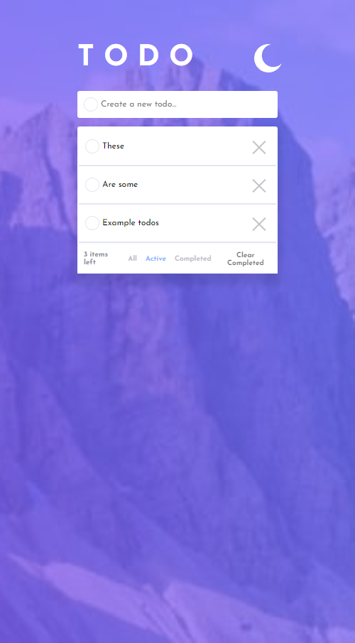
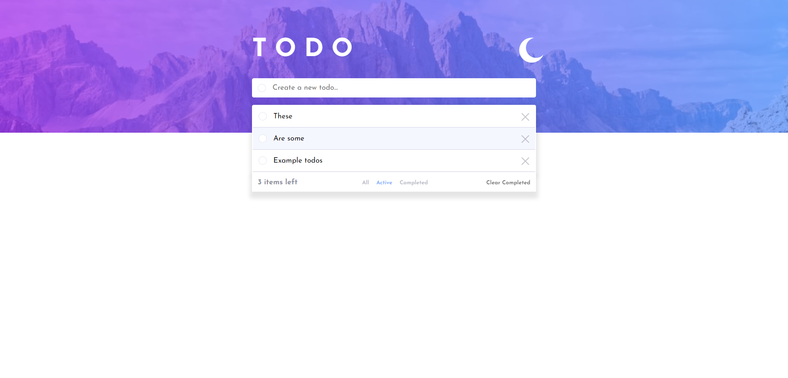

# Frontend Mentor - Todo app solution

This is a solution to the [Todo app challenge on Frontend Mentor](https://www.frontendmentor.io/challenges/todo-app-Su1_KokOW).

## Table of contents

- [Overview](#overview)
  - [The challenge](#the-challenge)
  - [Screenshot](#screenshot)
  - [Links](#links)
- [My process](#my-process)
  - [Built with](#built-with)
  - [What I learned](#what-i-learned)
  - [Useful resources](#useful-resources)
- [Author](#author)

**Note: Delete this note and update the table of contents based on what sections you keep.**

## Overview

### The challenge

Users should be able to:

- View the optimal layout for the app depending on their device's screen size
- See hover states for all interactive elements on the page
- Add new todos to the list
- Mark todos as complete
- Delete todos from the list
- Filter by all/active/complete todos
- Clear all completed todos
- Toggle light and dark mode

### Screenshot

### Links

- Solution URL: [https://kmarsic.github.io/Todo-app/](https://kmarsic.github.io/Todo-app/)

## My process

### Built with

- Semantic HTML5 markup
- CSS custom properties
- Flexbox
- [React](https://reactjs.org/) - JS library
- Redux
- React-beautiful-dnd

### What I learned

I played around with redux and drag'n drop and complicated my life a little around this simple project. But, I'm happy that I succeeded in everything I wanted to do. In the future I hope to learn how to use Redux even more, and get some thunks in there as well.

### Useful resources

- [React.dev](https://react.dev/reference/react/useEffect) - This helped me understand useEffect and how to properly use it in my project.
- [Redux](https://redux-toolkit.js.org/api/createSlice) - Helped me understand how reducers work

## Author

- LinkedIn - [https://www.linkedin.com/in/kmarsic/](https://www.linkedin.com/in/kmarsic/)
- Frontend Mentor - [https://www.frontendmentor.io/profile/kmarsic](https://www.frontendmentor.io/profile/kmarsic)
